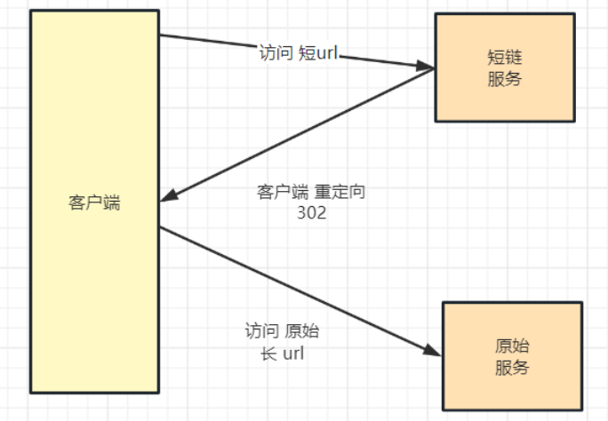

## 为什么要短链
1. 防止链接被滥用
2. 防止链接过长
3. 防止链接泄露

## 短链的原理


## 重定向的区别
1. 301：永久重定向，浏览器会缓存重定向后的网址，下次请求时直接访问缓存的网址。
2. 302：临时重定向，每次去请求短链都会去请求短网址服务器（除非响应中用 Cache-Control 或 Expired 暗示浏览器进行缓存）。

## 短链的实现
```go
package main
 
import (
    "database/sql"
    "fmt"
    "log"
    "net/http"
    "time"
 
    _ "github.com/go-sql-driver/mysql"
    "github.com/gomodule/redigo/redis"
)
 
// ShortLink 表示短链结构体
type ShortLink struct {
    ID          int
    ShortCode   string
    OriginalURL string
    ExpireTime  time.Time
}
 
// 生成短链
func generateShortCode() string {
    // 这里可以使用更复杂的算法生成唯一短码
    return fmt.Sprintf("%d", time.Now().UnixNano())
}
 
// 保存短链到 MySQL
func saveShortLinkToMySQL(db *sql.DB, shortLink ShortLink) error {
    query := "INSERT INTO short_links (short_code, original_url, expire_time) VALUES (?,?,?)"
    _, err := db.Exec(query, shortLink.ShortCode, shortLink.OriginalURL, shortLink.ExpireTime)
    return err
}
 
// 从 MySQL 中获取短链
func getShortLinkFromMySQL(db *sql.DB, shortCode string) (ShortLink, error) {
    query := "SELECT id, short_code, original_url, expire_time FROM short_links WHERE short_code =?"
    row := db.QueryRow(query, shortCode)
 
    var shortLink ShortLink
    err := row.Scan(&shortLink.ID, &shortLink.ShortCode, &shortLink.OriginalURL, &shortLink.ExpireTime)
    if err == sql.ErrNoRows {
        return shortLink, fmt.Errorf("短链未找到")
    } else if err!= nil {
        return shortLink, err
    }
    return shortLink, nil
}
 
// 保存热点 URL 到 Redis
func saveHotURLToRedis(conn redis.Conn, shortCode string, originalURL string) error {
    _, err := conn.Do("SET", shortCode, originalURL)
    if err!= nil {
        return err
    }
    // 设置过期时间
    _, err = conn.Do("EXPIRE", shortCode, 3600)  // 1 小时过期，可根据需求调整
    return err
}
 
// 从 Redis 中获取热点 URL
func getHotURLFromRedis(conn redis.Conn, shortCode string) (string, error) {
    originalURL, err := redis.String(conn.Do("GET", shortCode))
    if err == redis.ErrNil {
        return "", fmt.Errorf("Redis 中未找到热点短链")
    } else if err!= nil {
        return "", err
    }
    return originalURL, nil
}
 
// 处理短链请求
func handleShortLinkRequest(w http.ResponseWriter, r *http.Request) {
    shortCode := r.URL.Path[1:]
 
    // 尝试从 Redis 中获取
    redisConn, err := redis.Dial("tcp", "localhost:6379")
    if err!= nil {
        log.Println("连接 Redis 失败:", err)
        w.WriteHeader(http.StatusInternalServerError)
        return
    }
    defer redisConn.Close()
 
    originalURL, err := getHotURLFromRedis(redisConn, shortCode)
    if err == nil {
        // 重定向到原始 URL
        http.Redirect(w, r, originalURL, http.StatusFound)
        return
    }
 
    // 从 MySQL 中获取
    db, err := sql.Open("mysql", "username:password@tcp(localhost:3306)/database_name")
    if err!= nil {
        log.Println("连接 MySQL 失败:", err)
        w.WriteHeader(http.StatusInternalServerError)
        return
    }
    defer db.Close()
 
    shortLink, err := getShortLinkFromMySQL(db, shortCode)
    if err!= nil {
        w.WriteHeader(http.StatusNotFound)
        fmt.Fprintf(w, "短链未找到")
        return
    }
 
    // 检查是否过期
    if time.Now().After(shortLink.ExpireTime) {
        w.WriteHeader(http.StatusGone)
        fmt.Fprintf(w, "短链已过期")
        return
    }
 
    // 保存到 Redis 作为热点
    err = saveHotURLToRedis(redisConn, shortCode, shortLink.OriginalURL)
    if err!= nil {
        log.Println("保存到 Redis 失败:", err)
    }
 
    // 重定向到原始 URL
    http.Redirect(w, r, shortLink.OriginalURL, http.StatusFound)
}
 
func main() {
    http.HandleFunc("/", handleShortLinkRequest)
 
    log.Fatal(http.ListenAndServe(":8080", nil))
}
```

## 点击短链发生了什么
1. 用户访问短链，浏览器发送请求到服务器。
3. 服务器从 Redis 中获取热点 URL。
5. 如果热点 URL 不存在，则从 MySQL 中获取短链。
6. 服务器检查短链是否过期。
7. 如果短链过期，则返回 410 Gone。
8. 如果短链未过期，则保存到 Redis 作为热点。
9. 服务器重定向到原始 URL。

参考：<https://www.cnblogs.com/beatle-go/p/18301400>


