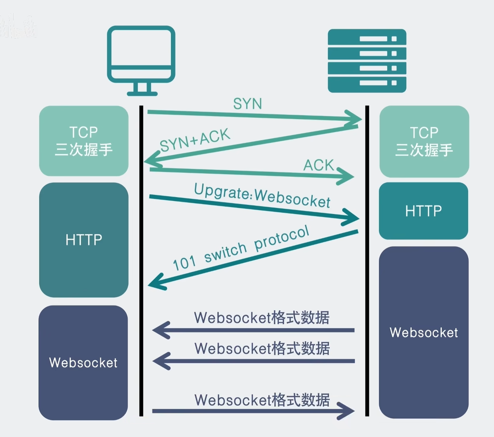

## 什么是WebSocket
WebSocket是一种通信协议，它是HTML5开始提供的一种协议。它实现了浏览器与服务器全双工通信，允许服务端主动向客户端推送数据。

## WebSocket的优劣
### 优点
- 实时性：WebSocket协议是基于TCP协议的，它实现了浏览器与服务器全双工通信，可以实现实时通信。
- 双向通信：WebSocket协议支持双向通信，即服务器和客户端都可以主动发送消息。
- 轻量级：WebSocket协议是轻量级的，占用系统资源小，通信速度快。
- 兼容性：WebSocket协议兼容主流浏览器，可以运行在PC、移动设备、服务器等多种环境。
### 缺点
- 安全性：WebSocket协议没有加密机制，容易遭受中间人攻击。
- 兼容性：WebSocket协议兼容性不如HTTP协议。

## WebSocket的应用场景
- 实时通信：WebSocket协议可以用于实时通信，如聊天、游戏、直播等。
- 物联网：WebSocket协议可以用于物联网设备的通信，如智能家居、智能车机等。
- 移动应用：WebSocket协议可以用于移动应用的实时通信，如即时通讯、在线视频聊天等。
- 云计算：WebSocket协议可以用于云计算服务的实时通信，如云游戏、云视讯等。

## WebSocket的流程

from 小白Debug


## WebSocket的go语言实现
1. 安装gorilla/websocket库
```
go get -u github.com/gorilla/websocket
```
2. 服务器端代码
```go
package main

import (
    "fmt"
    "net/http"

    "github.com/gorilla/websocket"
)

var upgrader = websocket.Upgrader{
    ReadBufferSize:  1024,
    WriteBufferSize: 1024,
}

var clients = make(map[*websocket.Conn]bool) // 连接的客户端
var broadcast = make(chan Message)          // 广播通道

type Message struct {
    Username string `json:"username"`
    Text     string `json:"text"`
}

func handleConnections(w http.ResponseWriter, r *http.Request) {
    // 升级HTTP连接为WebSocket连接
    ws, err := upgrader.Upgrade(w, r, nil)
    if err != nil {
        fmt.Println(err)
        return
    }
    defer ws.Close()

    // 注册新的客户端
    clients[ws] = true

    for {
        var msg Message
        // 读取客户端发送的消息
        err := ws.ReadJSON(&msg)
        if err != nil {
            delete(clients, ws)
            break
        }
        // 将消息发送到广播通道
        broadcast <- msg
    }
}

func handleMessages() {
    for {
        // 从广播通道获取消息
        msg := <-broadcast
        // 将消息发送给所有连接的客户端
        for client := range clients {
            err := client.WriteJSON(msg)
            if err != nil {
                client.Close()
                delete(clients, client)
            }
        }
    }
}

func main() {
    http.HandleFunc("/ws", handleConnections)
    go handleMessages()
    fmt.Println("WebSocket server started on :8080")
    err := http.ListenAndServe(":8080", nil)
    if err != nil {
        fmt.Println("ListenAndServe: ", err)
    }
}
```
3. 客户端代码
```go
package main

import (
    "bufio"
    "fmt"
    "net/url"
    "os"
    "os/signal"
    "syscall"

    "github.com/gorilla/websocket"
)

func main() {
    interrupt := make(chan os.Signal, 1)
    signal.Notify(interrupt, os.Interrupt, syscall.SIGTERM)

    u := url.URL{Scheme: "ws", Host: "localhost:8080", Path: "/ws"}
    fmt.Printf("Connecting to %s\n", u.String())

    c, _, err := websocket.DefaultDialer.Dial(u.String(), nil)
    if err != nil {
        fmt.Println("dial:", err)
        return
    }
    defer c.Close()

    done := make(chan struct{})

    go func() {
        defer close(done)
        for {
            _, message, err := c.ReadMessage()
            if err != nil {
                fmt.Println("read:", err)
                return
            }
            fmt.Printf("Received: %s\n", message)
        }
    }()

    scanner := bufio.NewScanner(os.Stdin)
    for {
        fmt.Print("Enter message: ")
        scanner.Scan()
        text := scanner.Text()

        err := c.WriteMessage(websocket.TextMessage, []byte(text))
        if err != nil {
            fmt.Println("write:", err)
            return
        }

        select {
        case <-done:
            return
        case <-interrupt:
            fmt.Println("interrupt")
            return
        }
    }
}
```

参考：<https://zhuanlan.zhihu.com/p/12482284609>


