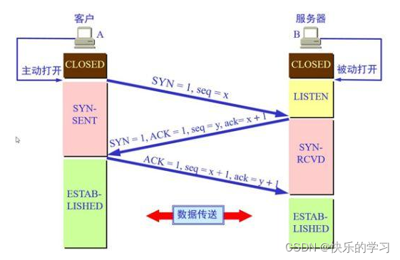
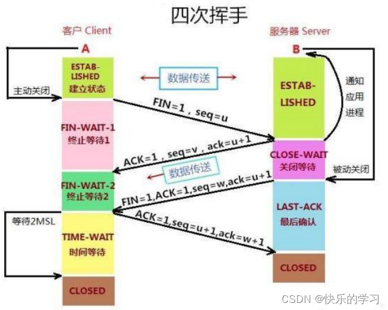

## 三次握手

- 一次握手:客户端发送带有 SYN（SEQ=x） 标志的数据包 -> 服务端，然后客户端进入 SYN_SEND 状态，等待服务端的确认；
- 二次握手:服务端发送带有 SYN+ACK(SEQ=y,ACK=x+1) 标志的数据包 –> 客户端,然后服务端进入 SYN_RECV 状态；
- 三次握手:客户端发送带有 ACK(ACK=y+1) 标志的数据包 –> 服务端，然后客户端和服务端都进入ESTABLISHED 状态，完成 TCP 三次握手。

为什么要三次握手？
1. 第一次握手：Client 什么都不能确认；Server 确认了对方发送正常，自己接收正常
2. 第二次握手：Client 确认了：自己发送、接收正常，对方发送、接收正常；Server 确认了：对方发送正常，自己接收正常
3. 第三次握手：Client 确认了：自己发送、接收正常，对方发送、接收正常；Server 确认了：自己发送、接收正常，对方发送、接收正常

## 四次挥手

- 第一次挥手：客户端发送一个 FIN（SEQ=x） 标志的数据包->服务端，用来关闭客户端到服务端的数据传送。然后客户端进入 FIN-WAIT-1 状态。
- 第二次挥手：服务端收到这个 FIN（SEQ=X） 标志的数据包，它发送一个 ACK （ACK=x+1）标志的数据包->客户端 。然后服务端进入 CLOSE-WAIT 状态，客户端进入 FIN-WAIT-2 状态。
- 第三次挥手：服务端发送一个 FIN (SEQ=y)标志的数据包->客户端，请求关闭连接，然后服务端进入 LAST-ACK 状态。
- 第四次挥手：客户端发送 ACK (ACK=y+1)标志的数据包->服务端，然后客户端进入TIME-WAIT状态，服务端在收到 ACK (ACK=y+1)标志的数据包后进入 CLOSE 状态。此时如果客户端等待 2MSL 后依然没有收到回复，就证明服务端已正常关闭，随后客户端也可以关闭连接了。

为什么要四次挥手？
1. 第一次挥手：A 说“我没啥要说的了”
2. 第二次挥手：B 回答“我知道了”，但是 B 可能还会有要说的话，A 不能要求 B 跟着自己的节奏结束通话
3. 第三次挥手：于是 B 可能又巴拉巴拉说了一通，最后 B 说“我说完了”
4. 第四次挥手：A 回答“知道了”，这样通话才算结束。

time_wait 的作用?
- 第四次挥手时，客户端发送给服务端的 ACK 有可能丢失，如果服务端因为某些原因而没有收到 ACK 的话，服务端就会重发 FIN，如果客户端在 2*MSL 的时间内收到了 FIN，就会重新发送 ACK 并再次等待 2MSL，防止 Server 没有收到 ACK 而不断重发 FIN。

参考：<https://javaguide.cn/cs-basics/network/tcp-connection-and-disconnection.html>