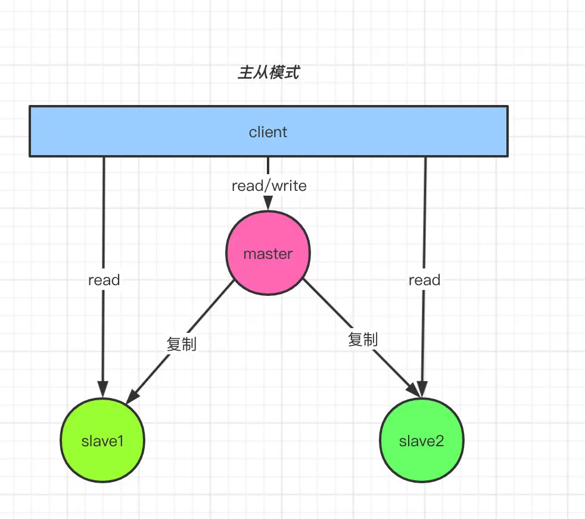
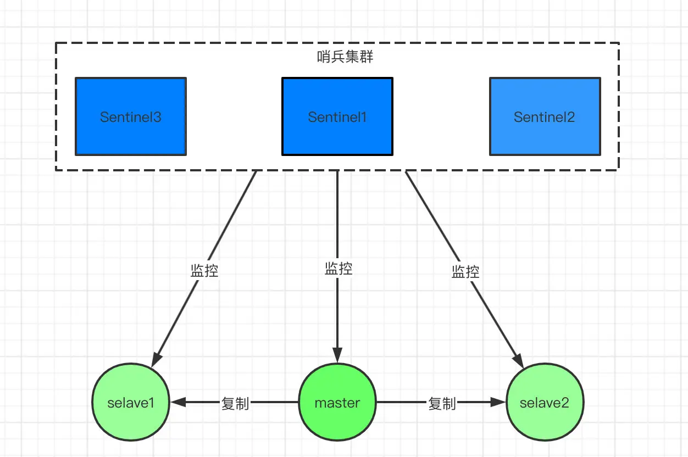
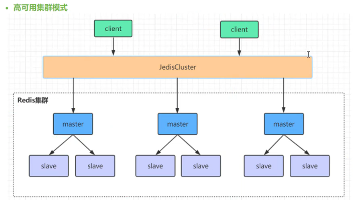

## 主从模式

### 主从模式优点
- 一旦主节点宕机，从节点作为主节点的备份可以随时顶上来。
- 扩展主节点的读能力，分担主节点读压力。
- 高可用基石：除了上述作用以外，主从复制还是哨兵模式和集群模式能够实施的基础，因此说主从复制是Redis高可用的基石。

### 主从模式缺点
- 一旦主节点宕机，从节点晋升成主节点，同时需要修改应用方的主节点地址，还需要命令所有从节点去复制新的主节点，整个过程需要人工干预。
- 主节点的写能力受到单机的限制。
- 主节点的存储能力受到单机的限制。

## 哨兵模式

### 哨兵模式优点
- 哨兵模式是基于主从模式的，所有主从的优点，哨兵模式都具有。
- 主从可以自动切换，系统更健壮，可用性更高。
- Sentinel 会不断的检查 主服务器 和 从服务器 是否正常运行。
- 当被监控的某个 Redis 服务器出现问题，Sentinel 通过API脚本向管理员或者其他的应用程序发送通知。

### 哨兵模式缺点
- Redis较难支持在线扩容，对于集群，容量达到上限时在线扩容会变得很复杂。
- 主从切换时，会有瞬断情况

## 集群模式

### 集群模式优点
- 集群模式是基于主从模式的，所有主从的优点，集群模式都具有。
- 集群模式支持在线扩容，通过增加节点来提升集群的容量和处理能力。
- 集群模式支持分布式，数据可以分布到多个节点上，不存在单点故障。
- 集群模式支持容错，当某个节点出现故障时，集群仍然可以正常提供服务。

### 集群模式缺点
- 单个节点的主从切换，仍会有瞬断情况。
- 集群模式需要依赖外部的服务发现组件，如Zookeeper，Consul。
- 集群模式需要做复杂的配置，如主从复制的配置，读写分离的配置等。

参考: <https://juejin.cn/post/6844904191236767751>
