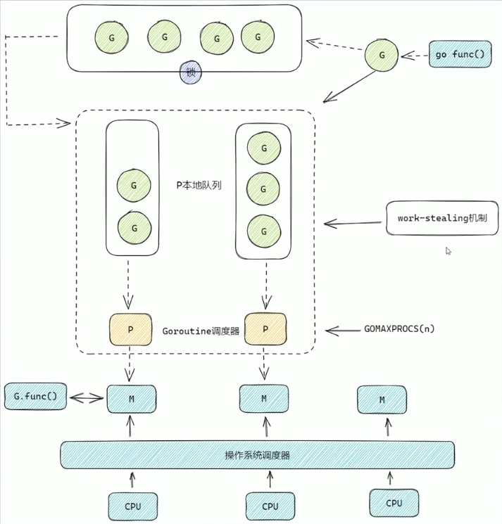

## GMP 模型

- G：Goroutine
- M：工作线程(OS thread)也被称为 Machine。
- G：Goroutine 调度器，可以通过 GOMAXPROCS 进行修改。

## 知识点
- 一个 P 对应一个 M。
- 每个 P 都有一个本地运行队列，里面存储着即将被执行的 G。
- 全局队列有锁，本地队列没有锁。
- G 优先放最少本地队列，如果全满了，才会放全局队列。
- P 的本地队列 G 执行完后，会去全局队列获取新的 G。
- P 的本地队列 G 执行完后，全局队列也没有了，就会 work-stealing。
- 全局队列中 G 和一个新 G，新 G 会优先放入本地队列。（全局队列会有饥饿现象，但减少了锁竞争）

## work-stealing

P 的本地队列 G 执行完后，全局队列也没有了。就从隔壁的本地队列偷**一半**的 G。
