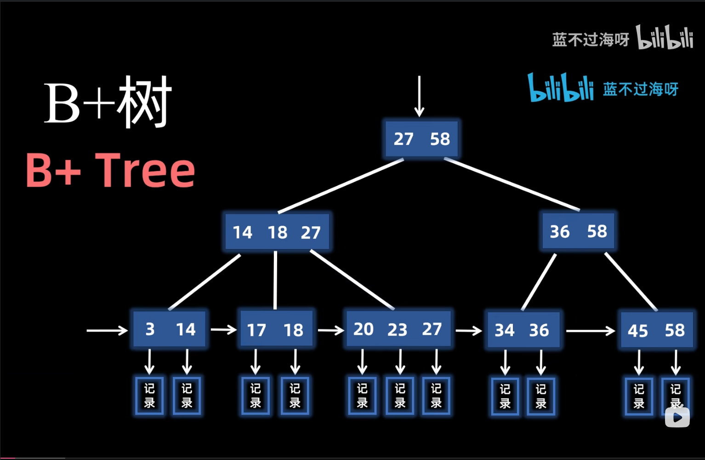
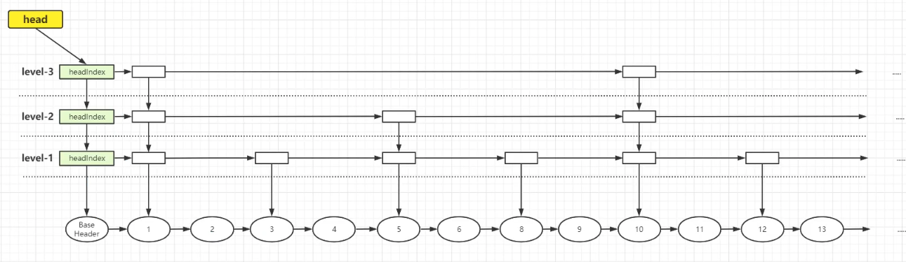

## b+树和跳表
- mysql 中使用 b+ 树来存储数据。
- redis 的有序集合使用跳表来实现。

## b+树


- 只有叶子节点才存储数据，中间节点只存储索引。
- 非叶子节点的索引可以有多个，从而实现范围查询。
- 叶子节点采用单向链表连接。

## 跳表


- 跳表的每个节点（除头节点和尾节点）都存储数据，同时维护指向其他节点的指针。
- 跳表的最低层是完整的双向链表，存储所有数据节点；高层是稀疏的单向链表，用于加速查找。

## 为什么innoDB使用b+树，redis使用跳表？

- b+树的高度更低，io少，适合磁盘存储（redis基于内存，io影响不大）。
- 范围查询，b+树支持，跳表不支持。
- 跳表实现较简单，b+树实现较复杂。

维度	| InnoDB（B + 树）	| Redis（跳表）
---	| ---	| ---
存储介质	| 磁盘（I/O 成本高）	| 内存（访问速度极快）
数据规模	| 海量数据（GB 级 +）	| 中小规模数据（GB 级 -）
查询类型	| 范围查询为主，需支持复杂 SQL	| 单点查询为主，少量范围查询（如排行榜）
更新频率	| 相对较低（写操作涉及磁盘 I/O）	| 高（内存操作无 I/O 延迟）
实现复杂度	| 高（需平衡树结构、事务、持久化）	| 低（随机层级 + 简单指针操作）
核心目标	| 数据持久化、复杂查询性能、稳定性	| 内存高性能、简单数据结构、快速读写

## go 实现跳表
```go
package main

import (
	"fmt"
	"math"
	"math/rand"
	"time"
)

const (
	maxLevel    = 32  // 最大层级
	probability = 0.25 // 晋升概率，控制层级分布
)

// SkipList 跳表结构
type SkipList struct {
	header       *Node     // 头节点
	tail         *Node     // 尾节点
	length       int       // 元素数量
	level        int       // 当前最大层级
	randSource   rand.Source // 随机数生成器
	probTable    []float64   // 预计算的概率表
}

// Node 跳表节点结构
type Node struct {
	member   string      // 成员名称
	score    float64     // 分数，排序依据
	backward *Node       // 后退指针
	level    []*NodeLevel // 层级数组
}

// NodeLevel 节点层级结构
type NodeLevel struct {
	forward *Node // 前向指针
	span    int   // 跨度
}

// NewSkipList 创建一个新的跳表实例
func NewSkipList() *SkipList {
	// 初始化随机数生成器
	randSource := rand.NewSource(time.Now().UnixNano())
	
	// 创建头节点和尾节点
	header := &Node{
		level: make([]*NodeLevel, maxLevel),
	}
	for i := 0; i < maxLevel; i++ {
		header.level[i] = &NodeLevel{
			forward: nil,
			span:    0,
		}
	}
	
	tail := &Node{}
	
	// 初始化头节点的所有层级都指向尾节点
	for i := 0; i < maxLevel; i++ {
		header.level[i].forward = tail
	}
	
	// 预计算概率表，用于快速计算随机层级
	probTable := make([]float64, maxLevel)
	for i := 0; i < maxLevel; i++ {
		probTable[i] = math.Pow(probability, float64(i))
	}
	
	return &SkipList{
		header:     header,
		tail:       tail,
		length:     0,
		level:      1,
		randSource: randSource,
		probTable:  probTable,
	}
}

// randomLevel 生成随机层级
func (sl *SkipList) randomLevel() int {
	r := float64(rand.New(sl.randSource).Int63()) / (1 << 63)
	level := 1
	
	for level < maxLevel && r < sl.probTable[level] {
		level++
	}
	
	if level > sl.level {
		sl.level = level
	}
	
	return level
}

// Insert 插入新元素
func (sl *SkipList) Insert(score float64, member string) {
	// 查找插入位置并记录路径
	update := make([]*Node, maxLevel)
	rank := make([]int, maxLevel)
	
	x := sl.header
	for i := sl.level - 1; i >= 0; i-- {
		if i == sl.level - 1 {
			rank[i] = 0
		} else {
			rank[i] = rank[i + 1]
		}
		
		for x.level[i].forward != sl.tail && 
		    (x.level[i].forward.score < score || 
		     (x.level[i].forward.score == score && x.level[i].forward.member < member)) {
			rank[i] += x.level[i].span
			x = x.level[i].forward
		}
		update[i] = x
	}
	
	// 创建新节点
	newLevel := sl.randomLevel()
	x = &Node{
		member:   member,
		score:    score,
		backward: nil,
		level:    make([]*NodeLevel, newLevel),
	}
	
	// 初始化新节点的层级
	for i := 0; i < newLevel; i++ {
		x.level[i] = &NodeLevel{
			forward: nil,
			span:    0,
		}
	}
	
	// 更新指针和跨度
	for i := 0; i < newLevel; i++ {
		x.level[i].forward = update[i].level[i].forward
		update[i].level[i].forward = x
		
		// 更新跨度
		x.level[i].span = update[i].level[i].span - (rank[0] - rank[i])
		update[i].level[i].span = (rank[0] - rank[i]) + 1
	}
	
	// 处理未触及的层级
	for i := newLevel; i < sl.level; i++ {
		update[i].level[i].span++
	}
	
	// 设置后退指针
	if update[0] == sl.header {
		x.backward = nil
	} else {
		x.backward = update[0]
	}
	
	if x.level[0].forward != sl.tail {
		x.level[0].forward.backward = x
	} else {
		sl.tail = x
	}
	
	sl.length++
}

// Delete 删除元素
func (sl *SkipList) Delete(score float64, member string) bool {
	// 查找要删除的节点并记录路径
	update := make([]*Node, maxLevel)
	x := sl.header
	
	for i := sl.level - 1; i >= 0; i-- {
		for x.level[i].forward != sl.tail && 
		    (x.level[i].forward.score < score || 
		     (x.level[i].forward.score == score && x.level[i].forward.member < member)) {
			x = x.level[i].forward
		}
		update[i] = x
	}
	
	// 检查是否找到要删除的节点
	x = x.level[0].forward
	if x == sl.tail || x.score != score || x.member != member {
		return false
	}
	
	// 更新指针和跨度
	for i := 0; i < sl.level; i++ {
		if update[i].level[i].forward != x {
			break
		}
		update[i].level[i].span += x.level[i].span - 1
		update[i].level[i].forward = x.level[i].forward
	}
	
	// 更新后退指针
	if x.level[0].forward != sl.tail {
		x.level[0].forward.backward = x.backward
	} else {
		sl.tail = x.backward
	}
	
	// 更新跳表的最大层级
	for sl.level > 1 && sl.header.level[sl.level-1].forward == sl.tail {
		sl.level--
	}
	
	sl.length--
	return true
}

// GetRank 获取元素排名（从1开始）
func (sl *SkipList) GetRank(score float64, member string) int {
	rank := 0
	x := sl.header
	
	for i := sl.level - 1; i >= 0; i-- {
		for x.level[i].forward != sl.tail && 
		    (x.level[i].forward.score < score || 
		     (x.level[i].forward.score == score && x.level[i].forward.member <= member)) {
			rank += x.level[i].span
			x = x.level[i].forward
			
			// 如果找到完全匹配的元素，返回排名
			if x.score == score && x.member == member {
				return rank
			}
		}
	}
	
	return 0 // 未找到元素
}

// GetElementByRank 根据排名获取元素
func (sl *SkipList) GetElementByRank(rank int) (string, float64, bool) {
	if rank <= 0 || rank > sl.length {
		return "", 0, false
	}
	
	accumulatedRank := 0
	x := sl.header
	
	for i := sl.level - 1; i >= 0; i-- {
		for x.level[i].forward != sl.tail && accumulatedRank + x.level[i].span <= rank {
			accumulatedRank += x.level[i].span
			x = x.level[i].forward
		}
		
		if accumulatedRank == rank {
			return x.member, x.score, true
		}
	}
	
	return "", 0, false // 未找到
}

// Find 查找元素
func (sl *SkipList) Find(score float64, member string) bool {
	x := sl.header
	
	for i := sl.level - 1; i >= 0; i-- {
		for x.level[i].forward != sl.tail && 
		    (x.level[i].forward.score < score || 
		     (x.level[i].forward.score == score && x.level[i].forward.member < member)) {
			x = x.level[i].forward
		}
	}
	
	x = x.level[0].forward
	return x != sl.tail && x.score == score && x.member == member
}

// Range 查询范围内的元素
func (sl *SkipList) Range(minScore, maxScore float64) []string {
	result := make([]string, 0)
	x := sl.header
	
	// 找到第一个大于等于minScore的节点
	for i := sl.level - 1; i >= 0; i-- {
		for x.level[i].forward != sl.tail && x.level[i].forward.score < minScore {
			x = x.level[i].forward
		}
	}
	
	// 从该节点开始遍历，收集所有小于等于maxScore的节点
	x = x.level[0].forward
	for x != sl.tail && x.score <= maxScore {
		result = append(result, fmt.Sprintf("(%s, %.2f)", x.member, x.score))
		x = x.level[0].forward
	}
	
	return result
}

// Len 返回跳表长度
func (sl *SkipList) Len() int {
	return sl.length
}

// Example 使用示例
func main() {
	// 创建跳表
	sl := NewSkipList()
	
	// 插入元素
	sl.Insert(85.5, "player1")
	sl.Insert(90.0, "player2")
	sl.Insert(78.2, "player3")
	sl.Insert(92.3, "player4")
	sl.Insert(88.1, "player5")
	
	// 查询元素
	fmt.Println("查找player3:", sl.Find(78.2, "player3")) // 输出: true
	fmt.Println("查找player6:", sl.Find(95.0, "player6")) // 输出: false
	
	// 获取排名
	fmt.Println("player4的排名:", sl.GetRank(92.3, "player4")) // 输出: 1
	
	// 根据排名获取元素
	member, score, ok := sl.GetElementByRank(3)
	if ok {
		fmt.Printf("排名第3的元素: %s (%.2f)\n", member, score) // 输出: player1 (85.50)
	}
	
	// 范围查询
	fmt.Println("分数在80-90之间的元素:", sl.Range(80.0, 90.0)) 
	// 输出: [(player1, 85.50), (player5, 88.10)]
	
	// 删除元素
	sl.Delete(90.0, "player2")
	fmt.Println("删除player2后，player2的排名:", sl.GetRank(90.0, "player2")) // 输出: 0
}
```
