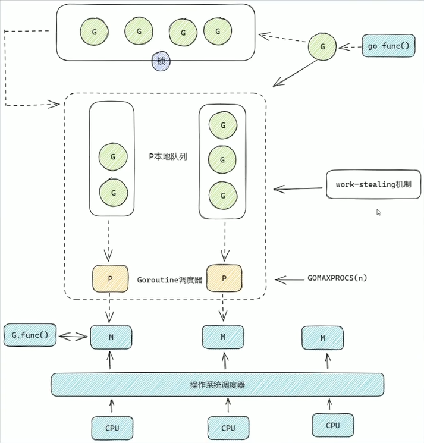

## GMP 模型

- G：Goroutine
- M：工作线程(OS thread)也被称为 Machine。
- P：Goroutine 调度器，可以通过 GOMAXPROCS 进行修改。

## 调度流程
1. 创建 Goroutine
    - 当通过 go func() 创建新的 Goroutine 时，G 会首先被加入到与当前 P 关联的本地队列中。
    - 如果 P 的本地队列已满（超过 256 个 G），则新的 G 会被放入全局队列。
2. 调度与执行
   - 每个 M 与一个 P 绑定，M 从 P 的本地队列中获取一个 G 来执行。
   - 如果 P 的本地队列为空，M 会尝试从全局队列或其他 P 的本地队列中偷取（work stealing）任务执行。
3. 系统调用与阻塞
   - 当 G 执行过程中发生阻塞或系统调用，M 也会被阻塞。这时，P 会解绑当前的 M，并尝试寻找或创建新的 M 来继续执行其他 G。
   - 阻塞结束后，原来的 M 会尝试重新绑定一个 P 继续执行。

## 知识点
- 一个 P 对应一个 M。(但P和M的数量不相关)
- 每个 P 都有一个本地运行队列，里面存储着即将被执行的 G。
- 全局队列有锁，本地队列没有锁。
- G 会关联某个 P，如果没有 P，会新建一个 P。
- G 优先放关联的 P 的本地队列，如果关联的 P 的本地队列满了，不会优先放到其他 P 的本地队列，而是会将本地队列中**一半**的 G 移动到全局队列，然后把新创建的 G 放入本地队列。
- P 的本地队列 G 执行完后，会去全局队列获取新的 G。
- P 的本地队列 G 执行完后，全局队列也没有了，就会 work-stealing。
- 全局队列中 G 和一个新 G，新 G 会优先放入本地队列。（全局队列会有饥饿现象，但减少了锁竞争）

## work-stealing
P 的本地队列 G 执行完后，全局队列也没有了。就从隔壁的本地队列偷**一半**的 G。

## G,P,M 的个数问题
1. G（Goroutine）的个数
    - 理论上无限制：G的数量在理论上是没有上限的，只要系统的内存足够，就可以创建大量的goroutine。这是因为goroutine比线程更轻量级，它们共享相同的地址空间，并且在堆上分配的内存相对较少。
    - 实际受内存限制：尽管理论上goroutine的数量没有限制，但实际上它们会受到系统可用内存的限制。每个goroutine都需要分配一定的栈空间（尽管栈的大小可以动态调整），而且goroutine之间共享的数据结构（如全局变量、通道等）也会占用内存。
2. P（Processor）的个数
   - 通常设置为逻辑CPU数的两倍：P的数量通常建议设置为逻辑CPU核心数的两倍，这是为了提高调度的并行性和效率。每个P都可以绑定到一个M上执行goroutine，而设置更多的P可以使得在某些M阻塞时，其他M仍然可以执行P上的goroutine，从而减少等待时间。
   - 由GOMAXPROCS决定：P的实际数量由环境变量GOMAXPROCS（或在Go程序中通过runtime.GOMAXPROCS函数设置）决定。这个值限制了同时运行的goroutine的数量，即在任何给定时间，最多只有GOMAXPROCS个goroutine在CPU上执行。
3. M（Machine/Thread）的个数
   - 动态创建和销毁：M的数量是动态变化的，Go运行时根据需要创建和销毁M。当一个M上的所有goroutine都阻塞时，该M可能会被销毁，而当有goroutine等待执行但没有可用的M时，会创建新的M。
   - 默认和最大限制：Go程序启动时，会设置一个M的最大数量（默认通常是10000，但这个值可能因Go版本和操作系统而异），但这个限制很少达到，因为操作系统本身就有线程/进程数量的限制。此外，通过runtime/debug包中的SetMaxThreads函数可以设置M的最大数量，但这个函数主要用于调试目的，不建议在生产环境中随意更改。
   - 与P的关系：M与P之间没有绝对的固定关系。一个M可以绑定到任意P上执行goroutine，而当M阻塞时，它会释放其绑定的P，P随后会尝试绑定到其他空闲的M上。因此，即使P的数量较少，也可能因为工作量窃取和M的动态创建而有大量的M存在（尽管这些M中的大多数可能在等待中）。

## 为什么要有 P？
- 每个 P 有自己的本地队列，大幅度的减轻了对全局队列的直接依赖，所带来的效果就是锁竞争的减少。而 GMP 模型的性能开销大头就是锁竞争。
- 每个 P 相对的平衡上，在 GMP 模型中也实现了 Work Stealing （工作量窃取机制）算法，如果 P 的本地队列为空，则会从全局队列或其他 P 的本地队列中窃取可运行的 G 来运行，减少空转，提高了资源利用率。
