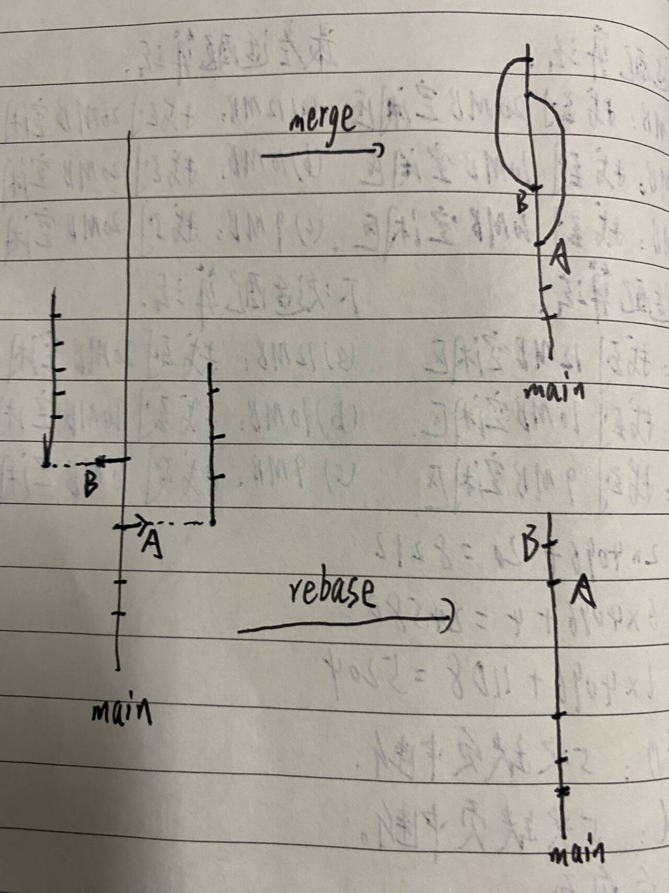
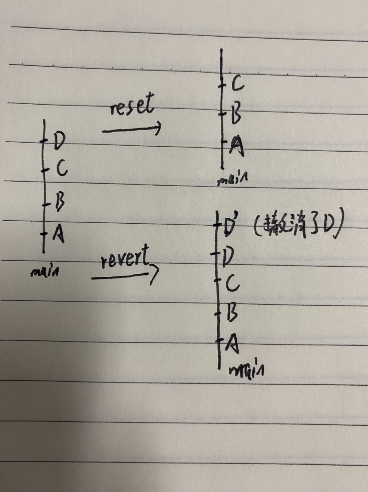

## git merge 与 git rebase 的区别
- git merge：保留分支历史，将两个分支的提交合并，产生一次新的合并提交。
- git rebase：重写提交历史，将某个分支的提交“挪到”另一个分支之后，就像是从那儿开始的新分支。

## git reset(rollback) 与 git revert 的区别
- git revert：创建一个新的“撤销提交”，保留历史记录，适合团队协作。
- git reset：直接“回滚历史到某个状态”，可能会修改提交历史，不适合已 push 的代码。

