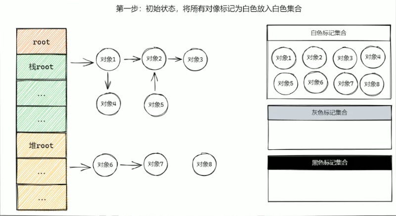
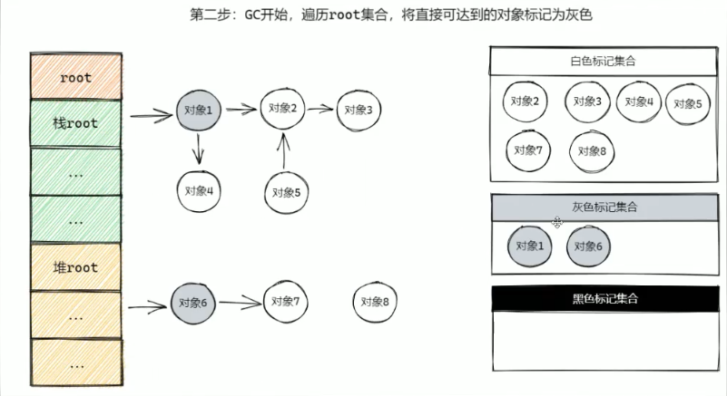
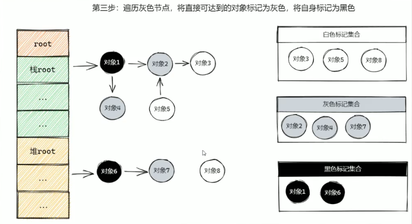
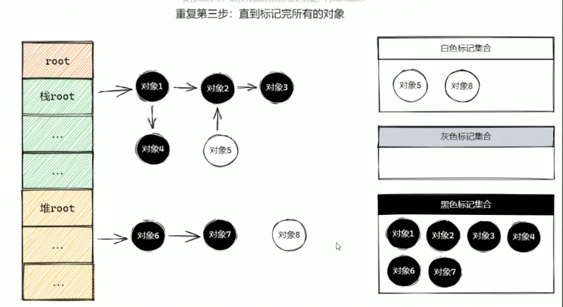
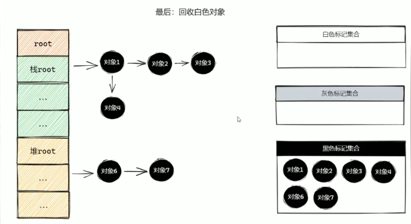

## 三色标记法
- 白色：尚未被追踪。
- 灰色：已被追踪，但其子节点还未被探索。
- 黑色：已被完全探索。（活跃）

## 强三色不变式
不存在黑色对象引用白色对象。

## 弱三色不变式
所有被黑色对象引用的白色对象都必须有上游的灰色对象。

- 强弱三色不变式：解决漏标问题（黑色对象引用白色对象）。

## 写屏障
写屏障（write barrier）是一种技术，用于解决 GC 标记阶段 即使对象变化，也能满足强弱三色不变式。

1. 插入写屏障：
并发标记阶段，当一个黑色对象**新**指向一个白色对象时，将白色对象标记为灰色。

2. 删除写屏障：
并发标记阶段，当一个灰色对象**删除**指向一个白色对象的指针时，将白色对象标记为灰色。

3. 混合写屏障：
插入写屏障 + 删除写屏障。

## 注意
- **栈区没有写屏障**
- 栈区的黑色对象新增引用白色对象，直接标记为黑色。（删除时不变，等下一次 GC）

参考：<https://www.bilibili.com/video/BV1SLtVe7EDR?vd_source=1fc15dfc7872eca10bc43b8ee8d73958>
