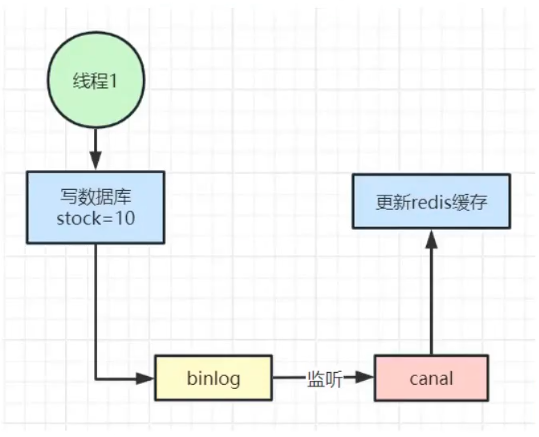

## 为什么不一致

## 缓存与数据库双写一致性方案

### 1. 更新数据库之后删除缓存（解决部分不一致）

### 2. 加分布式锁（完全一致性，性能较差）

### 3. canal 异步更新缓存（最终一致性，性能较好）

### 4. 设置较短的过期时间（最终一致性，性能较好，最简单）

### 5. 1的优化：
- 延迟双删策略：为了处理在缓存删除和数据库更新之间可能发生的并发请求，可以采用延迟双删策略：

- 写操作流程：
1. 先删除Redis中的缓存数据。
2. 更新MySQL中的数据。
3. 延迟一小段时间（例如，几百毫秒），再次删除Redis中的缓存数据。

- 延迟的目的是为了处理在这个短暂的时间窗口内可能到达的并发读请求，这些请求可能会再次将旧数据加载到缓存中。
